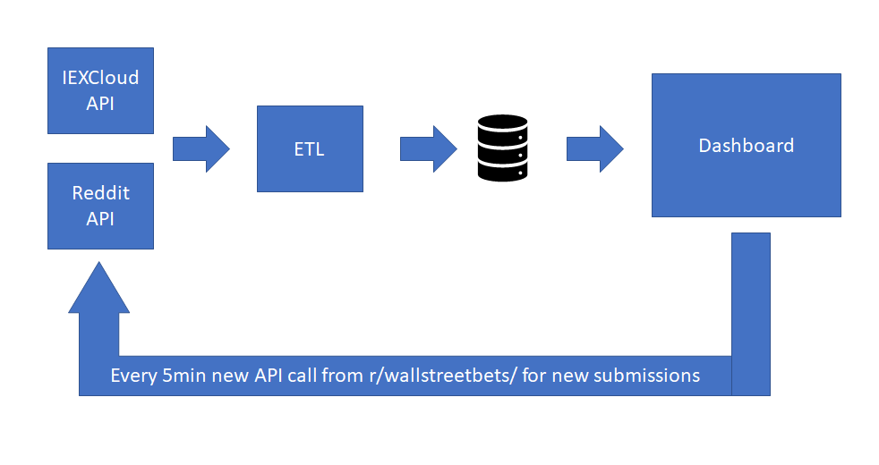
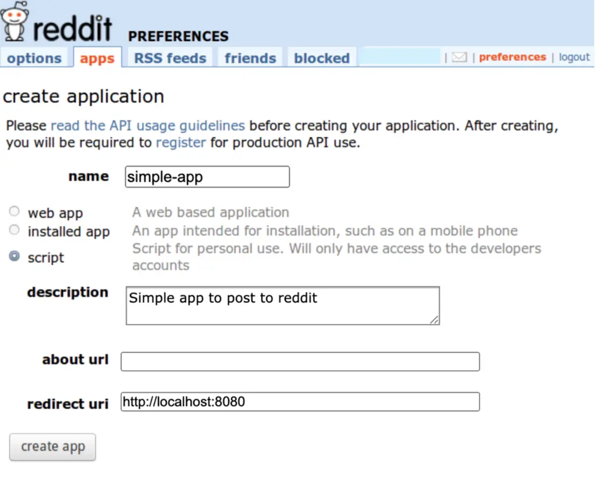
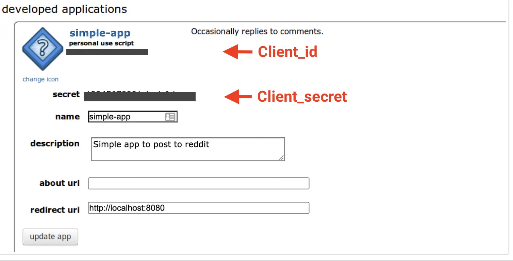
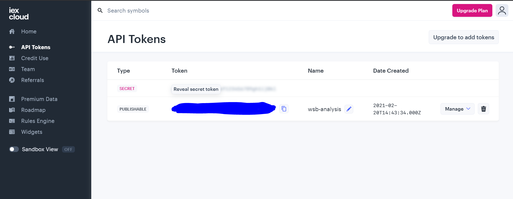
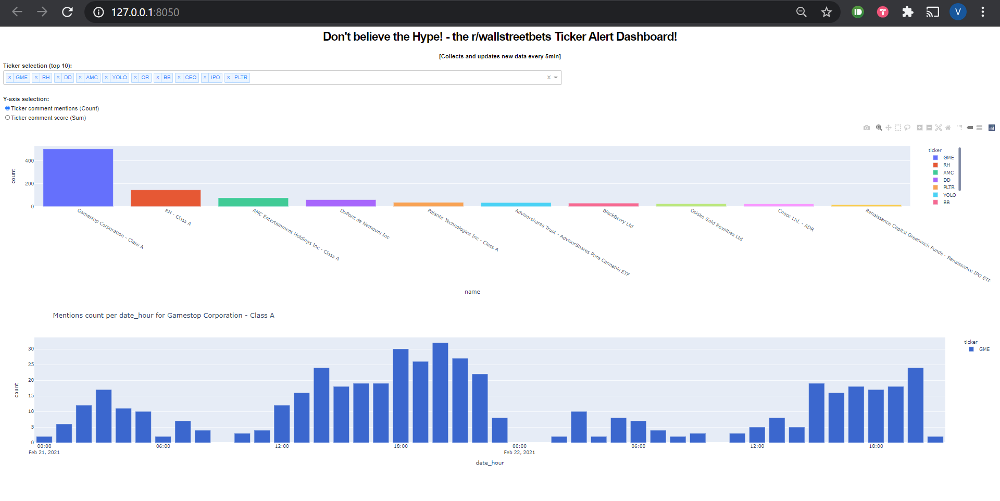

# Don't Believe the Hype - r/wallstreetbets Ticker Alert

This app collects and analyze data from the subreddit [www.reddit.com/r/wallstreetbets/](https://www.reddit.com/r/wallstreetbets/), an forum or subreddit on the social news website Reddit. The subreddit has gained a lot of popularity since the [GameStop short squeeze](https://en.wikipedia.org/wiki/GameStop_short_squeeze). Due to the forums ability to impact the market it could be of interest to know what finanical instruments, also known as tickers, is currently being discussed to anticipate increased volatility. 

The ticker hype aleart dashboard consist of several elements:

* Data collection from [IEX Cloud API](https://iexcloud.io/) to get offical tickers. Using [IEX Cloud Python SDK](https://pypi.org/project/iexfinance/).
* Data collection from [Reddit API](https://www.reddit.com/r/wallstreetbets/) get all tickers mentioned in comments. Using [PRAW: The Python Reddit API Wrapper](https://praw.readthedocs.io/en/latest/index.html)
* ETL process to filter out comments that contain offical tickers. 
* Sqlite3 to store all data. 
* Plotly Dash dashboard to show the most mentioned tickers.
* API call from dashboard to get new data every 5min.




## Installation Guide
### Requirements
The following utilities are prerequisites to installing the app:

- git
- Python 3.8+ with pip and virtual environment (pip install venv)
- User accounts for both IEXCloud and Reddit (both available for free)
PS. App only tested with Python3.8.6. But might work with any Python 3.5+.

Once these utilities are installed, the user can install the Python dependencies. Installing dependencies in a Python virtual environment prevents issues at the system level, but installing in a virtual environment is not required. 

### Clone Repository
Installation of the app requires cloning of the core repository. This uses Git. This will bring
down all the necessary files.
```
git clone https://github.com/vstiern/wsb-hype-alert.git
cd wsb-hype-alert
```

### Create and Activate a new Python Environment
This will create a new virtual environment for app to be installed into. The following commands
will create a new virtual environment called `.venv` and ensure that virtual environment
is activated.
```
python3 -m venv .venv
.venv/bin/activate              # For Linux, Mac OSX, WSL operating system
.venv\Scripts\activate.bat      # For Windows operating system
```

### Installing Python Requirements
This app requires certain Python packages to work. Install all the required Python dependencies for the app.
```
pip install -r requirements.txt
```

### Get access to APIs
This app uses two apis. To get access to these services the user need to create a personal account. The client values/tokens need to be enter into the file `config.ini` under the correct header.

#### Reddit 
1. Login to [Reddit](https://reddit.com).
2. Go to [Reddit Apps](https://reddit.com/prefs/apps/).
3. Select “script” as the type of app.
4. Name the app and give it a description.
5. Set-up the redirect url to be http://localhost:8080.
6. Enter the values of **client_id** and **client_secret** to the file `config.ini` under the [reddit] header. Also enter username and password for the users reddit account in this section.




#### IEX Cloud
1. Login to [IEX Cloud](https://reddit.com).
2. Go to [API Tokens](https://iexcloud.io/console/tokens)
3. Enter the value of **PUBLISHABLE** to the file `config.ini` under the [iexfinance] header and token key.



### Start application
Finally, to start the app run the following command. And then go to the dashboard url: http://127.0.0.1:8050/.
```
python app.py
```

## The Dashboard
The dashboard the shows the top10 most mentioned tickers. The user can select what tickers to include and whether to see the number of times a ticker has been mentioed (count) or the aggregated score (upvotes - downvotes) for all the comments that mentions the ticker. By hovering or clicking at a specific ticker in the top graph the graph below will show a breakdown by date and hour for the selected feature - count or score. Double click to reset the graph from zoom in.



## Notice
The app is early proof of concept and therefore might not work correctly. Here are some things to keep in mind at this stage.

### Cold Start
Notice that the first time using the app the initization time be a bit longer. The app will download around 9000 tickers from IEX Cloud that will be saved to the database. For later usage, this process will be skipped.

### Reddit API
The rate of comment extraction might vary depending on usage of api account.

### Reddit Data
- The app only extracts mentioned tickers from comments and not the text of a submission. The initial data comes from the page sorting `r/wallstreetbets/hot`, which displays the most commented and upvoted submissions. For new data the app extracts data from the most recent submissions to the subreddit `r/wallstreetbets/new`.
- The number of submissions and comments that will be extracted can be modified by changing the **cold_start** and **new_data** limit values in the `config.ini` file. 
- The app only count unique ticker mention per comment.

## Development
This app has a lot of more potential and the following features are in the development pipeline:
1. Price data - Show intraday price data against count/score. This would allow the user to see how the market price is moving in accordance with the forums activity.
2. Sentiment analysis - Rather than just observing the number of comments that talks about a ticker, it would be interesting to analyze the content and to see whether the forum has a positive or negative sentiment to the price. 
3. Use more sources - what tickers are been mentioned on other subreddits, Twitter and forums. The more sources we can analyze, the more hype and risk can be mitigated.  